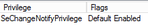

# Running With least privilege

I don't like the fact that the Motash Service has to run under the local system account.

When running the process has tons of privileges, here's a screenshot showing Process Explorer:

You can tell the system which privileges are actually required to run the service, it turns out
Motash runs fine with just the minimal privileges. Open an elevated command prompt an type:

`sc.exe privs motash seChangeNotifyPrivilege`

Now restart the service:

    net stop motash & net start motash

or in PowerShell:

    Restart-Service -Name motash

look at the new process in Process Explorer again:

The services is still able to query the task scheduler, but now has very limited abilities to do anything else on the system.

The service installer could be changed to required these minimal privileges, but this way it's up to the user to harden their system.